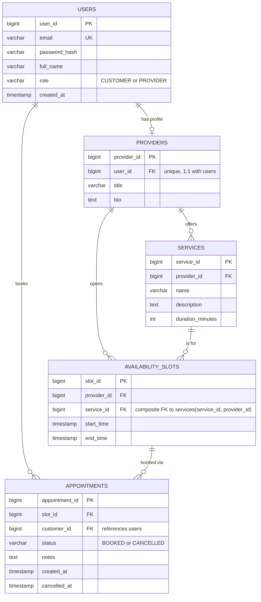

# TutorSlot

A tutoring appointment booking system built for SJSU CMPE 172. Students (customers) browse
tutors' open time slots and book sessions; tutors (providers) publish availability for the
subjects they teach.

This project is being built across 4 milestones. **This repository currently implements
Milestone 1: Requirements, Design & Skeleton** — the database, a layered Spring Boot skeleton,
and two read-only pages. Booking, login, notifications, and the AI agent features are later
milestones and are not implemented yet.

## Tech stack

- Java 21, Spring Boot 3.5.3, Maven (with the Maven wrapper, so no local Maven install is needed)
- Spring Web, Thymeleaf (server-rendered views, Page Controller pattern)
- Data access: plain SQL via `JdbcTemplate` — no ORM, no Spring Data JPA, no `@Entity`
- PostgreSQL

## Architecture

Strict layering, one direction only:

```
Controller -> Service -> Repository -> PostgreSQL
```

- **Controllers** handle HTTP and return Thymeleaf views. No SQL, no business logic.
- **Services** hold business rules and convert repository models into view-facing DTOs.
- **Repositories** hold all the SQL, one class per table, using `JdbcTemplate` + `RowMapper`.
- **Models** are plain Java records mirroring table rows.
- **DTOs** are plain Java records with only the fields a given page needs.

## Folder structure

```
TutorSlot/
├── pom.xml
├── mvnw, mvnw.cmd              # Maven wrapper — build/run without a local Maven install
├── src/
│   ├── main/
│   │   ├── java/com/tutorslot/
│   │   │   ├── TutorSlotApplication.java   # Spring Boot entry point
│   │   │   ├── controller/                 # HomeController (GET /), SlotController (GET /slots)
│   │   │   ├── service/                    # ProviderService, AvailabilitySlotService
│   │   │   ├── repository/                 # UserRepository, ProviderRepository,
│   │   │   │                               #   SubjectRepository, AvailabilitySlotRepository
│   │   │   ├── model/                      # User, Provider, Subject, AvailabilitySlot
│   │   │   └── dto/                        # ProviderSummaryDto, SubjectDto, SlotDto
│   │   └── resources/
│   │       ├── schema.sql                  # all 5 tables + constraints, rerunnable
│   │       ├── seed.sql                    # sample tutors, students, subjects, slots
│   │       ├── application.properties
│   │       └── templates/                  # home.html, slots.html
│   └── test/java/com/tutorslot/
│       ├── repository/RepositorySmokeTest.java
│       └── service/ServiceLayerSmokeTest.java
```

## Database design (ER diagram)

Five tables. `services` holds the subjects a tutor teaches; `availability_slots` are the
bookable time windows; a slot is "available" when it's in the future and has no active `BOOKED`
appointment — that's computed at query time, not stored as a column.



The double-booking guard lives in the database itself: a partial unique index,
`UNIQUE (slot_id) WHERE status = 'BOOKED'`, guarantees at most one active booking per slot, so two
simultaneous booking requests can't both succeed.

## How to run

### Prerequisites
- Java 21
- A local PostgreSQL server with a `tutorslot_db` database, and a `postgres` role/password
  matching `src/main/resources/application.properties` (defaults to `postgres`/`postgres`,
  overridable via the `DB_USERNAME`/`DB_PASSWORD` environment variables)

### Run the app
```bash
./mvnw spring-boot:run
```
This automatically (re)creates the schema and loads sample data on every startup via
`spring.sql.init` — no separate migration step needed. Then visit:
- `http://localhost:8080/` — providers and the subjects they teach
- `http://localhost:8080/slots` — available future slots, ordered by start time

### Run the tests
```bash
./mvnw test
```

### Build a jar
```bash
./mvnw clean package
```

## Current scope (Milestone 1)

Implemented: the database schema (designed so later milestones fit without restructuring), the
full layered skeleton, and two read-only pages (`GET /`, `GET /slots`).

Not yet implemented (later milestones): login, booking/cancelling appointments, provider slot
management, pagination/filtering, notifications, logging/metrics, and the AI booking agent.
