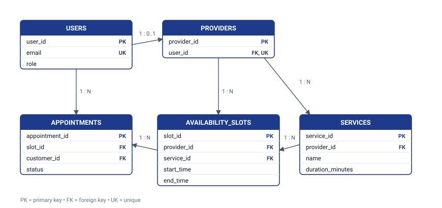

# TutorSlot

A tutoring appointment booking system built for SJSU CMPE 172. Students (customers) browse
tutors' open time slots and book sessions; tutors (providers) publish availability for the
subjects they teach.

This project is being built across 4 milestones. **This repository currently implements
Milestone 1 and Milestone 2**: the database, a layered Spring Boot skeleton, login with roles,
browsing/filtering/booking slots, cancelling appointments, and a provider dashboard for managing
slots. Notifications, logging/metrics, and the AI agent features are later milestones and are not
implemented yet.

## Tech stack

- Java 21, Spring Boot 3.5.3, Maven (with the Maven wrapper, so no local Maven install is needed)
- Spring Web, Thymeleaf (server-rendered views, Page Controller pattern)
- Spring Security (form login, session-based, CSRF on) + `thymeleaf-extras-springsecurity6` for
  role-aware navigation
- Jakarta Bean Validation (`spring-boot-starter-validation`) for form input
- Data access: plain SQL via `JdbcTemplate` / `NamedParameterJdbcTemplate` — no ORM, no Spring
  Data JPA, no `@Entity`
- PostgreSQL

## Architecture

Strict layering, one direction only:

```
Controller -> Service -> Repository -> PostgreSQL
```

- **Controllers** handle HTTP and return Thymeleaf views. No SQL, no business logic.
- **Services** hold business rules (including the booking transaction) and convert repository
  models into view-facing DTOs.
- **Repositories** hold all the SQL, one class per table, using `JdbcTemplate`/
  `NamedParameterJdbcTemplate` + `RowMapper`.
- **Models** are plain Java records mirroring table rows.
- **DTOs** are plain Java records with only the fields a given page needs.
- **`security/`** wires up Spring Security: a `UserDetailsService` that loads users via
  `JdbcTemplate` (no Spring Data), and the URL/role rules.
- **`exception/` + `web/GlobalExceptionHandler`**: a small set of custom exceptions
  (`NotFoundException`, `ForbiddenException`, `SlotConflictException`) mapped centrally to HTTP
  status codes and their own error pages — never a stack trace, never a raw Spring message.

## Folder structure

```
TutorSlot/
├── pom.xml
├── mvnw, mvnw.cmd                     # Maven wrapper — build/run without a local Maven install
├── docs/er-diagram.svg                # ER diagram used in this README
├── src/
│   ├── main/
│   │   ├── java/com/tutorslot/
│   │   │   ├── TutorSlotApplication.java      # Spring Boot entry point
│   │   │   ├── controller/                    # HomeController, SlotController, LoginController,
│   │   │   │                                  #   BookingController, AppointmentController,
│   │   │   │                                  #   ProviderController
│   │   │   ├── security/                      # SecurityConfig, AppUserDetailsService, UserPrincipal
│   │   │   ├── service/                       # ProviderService, AvailabilitySlotService,
│   │   │   │                                  #   BookingService, BookingFacade, AppointmentService,
│   │   │   │                                  #   ProviderDashboardService, CurrentUserService
│   │   │   ├── repository/                    # UserRepository, ProviderRepository, SubjectRepository,
│   │   │   │                                  #   AvailabilitySlotRepository, AppointmentRepository
│   │   │   ├── model/                         # User, Provider, Subject, AvailabilitySlot, Appointment
│   │   │   ├── dto/                           # view-facing DTOs (one per page/concern)
│   │   │   ├── exception/                     # NotFoundException, ForbiddenException, SlotConflictException
│   │   │   └── web/                           # GlobalExceptionHandler (@ControllerAdvice)
│   │   └── resources/
│   │       ├── schema.sql                      # all 5 tables + constraints, rerunnable
│   │       ├── seed.sql                        # sample tutors, students, subjects, slots, bookings
│   │       ├── application.properties
│   │       └── templates/
│   │           ├── home.html, slots.html, login.html
│   │           ├── customer/                   # book.html, confirmation.html, appointments.html
│   │           ├── provider/                   # dashboard.html, appointments.html
│   │           ├── error/                      # 400, 403, 404, 409, 500
│   │           └── fragments/                  # navbar.html (role-aware, sec:authorize)
│   └── test/java/com/tutorslot/
│       ├── repository/RepositorySmokeTest.java
│       ├── dto/CreateSlotRequestTest.java      # Bean Validation on the slot-creation form
│       └── service/
│           ├── ServiceLayerSmokeTest.java
│           ├── BookingServiceTest.java         # Mockito, no Spring context
│           ├── BookingFacadeTest.java          # retry behavior
│           ├── AppointmentServiceCancelTest.java
│           ├── ProviderDashboardServiceTest.java
│           └── BookingConcurrencyTest.java     # the key test — see "Booking concurrency" below
```

## Database design (ER diagram)

Five tables. `services` holds the subjects a tutor teaches; `availability_slots` are the
bookable time windows; a slot is "available" when it's in the future and has no active `BOOKED`
appointment — that's computed at query time, not stored as a column.



Only keys and the few fields that matter for understanding the flow are shown here (`role` on
`users`, `status` on `appointments`, timing on `availability_slots`) — the full column list with
every constraint is in `schema.sql` and the prose above.

The double-booking guard lives in the database itself: a partial unique index,
`UNIQUE (slot_id) WHERE status = 'BOOKED'`, guarantees at most one active booking per slot, so two
simultaneous booking requests can't both succeed. See "Booking concurrency" below for how the
application layer works with this guarantee rather than around it.

## Demo logins

Every seeded account shares the password **`password123`**.

| Role | Email |
|---|---|
| Customer | `dan.student@sjsu.edu` |
| Provider | `alice.tutor@sjsu.edu` |

(Full roster in `src/main/resources/seed.sql` — 8 users total: 4 tutors, 4 students.)

## Pages and endpoints

| Method | URL | Who | Purpose |
|---|---|---|---|
| GET | `/` | public | Home — tutors and the subjects they teach |
| GET | `/slots` | public | Browse, filter (tutor/subject/date), and paginate available slots |
| GET | `/login` | public | Login form |
| POST | `/logout` | logged in | Logout |
| GET | `/customer/book?slotId=` | CUSTOMER | Book form — slot summary + optional notes |
| POST | `/customer/book` | CUSTOMER | Submit the booking, redirect to confirmation (Post/Redirect/Get) |
| GET | `/customer/appointments/{id}/confirmation` | CUSTOMER, owner | Confirmation page |
| GET | `/customer/appointments` | CUSTOMER | My appointments — Upcoming and History |
| POST | `/customer/appointments/{id}/cancel` | CUSTOMER, owner | Cancel an upcoming appointment |
| GET | `/provider/dashboard` | PROVIDER | My slots (booked/open) + create-slot form |
| POST | `/provider/slots` | PROVIDER | Create a slot |
| POST | `/provider/slots/{id}/delete` | PROVIDER, owner | Remove a slot (only if never booked) |
| GET | `/provider/appointments` | PROVIDER | Appointments booked with me — Upcoming and History |

A logged-in user hitting a page outside their role gets a `403` page, not a redirect to login. A
logged-out user hitting a protected page is sent to `/login`.

## Booking concurrency

This is the core design problem Milestone 2 adds: two students must never be able to book the
same slot, even if they click "Book" at the exact same instant.

**`BookingService.book(slotId, customerId, notes)`** is `@Transactional` at `READ COMMITTED`
(Postgres's default, set explicitly so it's visible in the code) and does, in order:
1. `SELECT ... FROM availability_slots WHERE slot_id = ? FOR UPDATE` — locks the row. A second
   transaction trying to book the same slot blocks here until the first commits or rolls back.
2. Checks the slot's `start_time` is still in the future.
3. Checks whether the slot already has an active `BOOKED` appointment.
4. Inserts the new appointment.

Why `READ COMMITTED` specifically matters: because it re-reads on every new statement, the second
(now-unblocked) transaction's step 3 check sees the first transaction's just-committed booking
and correctly reports a conflict. Under `REPEATABLE READ`, step 3 would still see the pre-lock
snapshot and miss it — only the database's own unique index would catch it at that point.

**The backstop**: even if the row lock were somehow bypassed, the partial unique index itself
(`uq_one_active_booking_per_slot`) rejects a second `BOOKED` row for the same slot with a
`DuplicateKeyException`, which `BookingService` translates into the same `SlotConflictException`
(409) a normal conflict produces.

**`BookingFacade`** wraps `BookingService.book()` in a retry loop (up to 3 attempts, short sleep
between) that retries only on a transient lock-acquisition failure
(`PessimisticLockingFailureException`) — never on `SlotConflictException`, which is a real
conflict, not a temporary one. It's a separate Spring bean on purpose: a `@Transactional` method
called from another method on the *same* class bypasses Spring's proxy, so no transaction would
actually start on a retry. Controllers call this facade, never `BookingService` directly.

`BookingConcurrencyTest` proves this holds under real concurrency (two threads racing to book the
same slot via a `CountDownLatch` start gate — exactly one succeeds, the database ends up with
exactly one `BOOKED` row) and proves the backstop in isolation (two direct JDBC inserts, the
second throws `DuplicateKeyException`). It's been run 5 times in a row with a fresh database each
time with no failures.

## How to run

### Prerequisites
- Java 21
- A local PostgreSQL server with a `tutorslot_db` database, and a `postgres` role/password
  matching `src/main/resources/application.properties` (defaults to `postgres`/`postgres`,
  overridable via the `DB_USERNAME`/`DB_PASSWORD` environment variables)

### Run the app
```bash
./mvnw spring-boot:run
```
This automatically (re)creates the schema and loads sample data on every startup via
`spring.sql.init` — no separate migration step needed. Then visit `http://localhost:8080/` and
log in with one of the demo accounts above.

### Run the tests
```bash
./mvnw test
```
Runs both kinds of tests in the project:
- **Unit tests** (`BookingServiceTest`, `BookingFacadeTest`, `AppointmentServiceCancelTest`,
  `ProviderDashboardServiceTest`, `CreateSlotRequestTest`) — JUnit 5 + Mockito, no Spring context,
  no database.
- **Integration tests** (`RepositorySmokeTest`, `ServiceLayerSmokeTest`, `BookingConcurrencyTest`)
  — `@SpringBootTest` against the real local PostgreSQL; `spring.sql.init` reloads `schema.sql` +
  `seed.sql` before they run, so they're always checked against real, known data.

### Build a jar
```bash
./mvnw clean package
```

## Current scope (Milestone 1 + 2)

Implemented: the database schema, the full layered skeleton, login with roles, browsing/
filtering/paginating slots, booking with concurrency-safe locking, cancelling, a provider
dashboard for creating/removing slots, and full validation/error handling (400/403/404/409, no
stack traces ever).

Not yet implemented (later milestones): a mock external notification service, logging/health
endpoint/metrics, and the AI booking agent / RAG Q&A.
